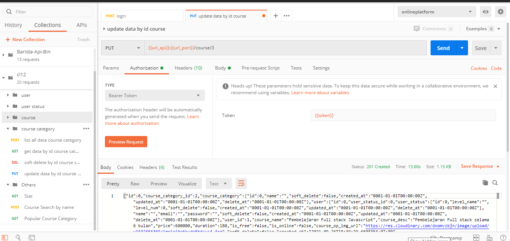
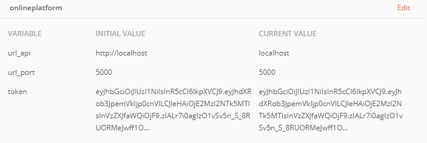

first install golang library on https://golang.org/. you can choose what your platform

 ## Running Local
You should install some module first before running the application :

``` bash
go get github.com/badoux/checkmail
go get github.com/jinzhu/gorm
go get golang.org/x/crypto/bcrypt
go get github.com/dgrijalva/jwt-go
go get github.com/gorilla/mux
go get github.com/jinzhu/gorm/dialects/mysql
go get github.com/jinzhu/gorm/dialects/sqlite
go get github.com/joho/godotenv
go get gopkg.in/go-playground/assert.v1
go get github.com/cloudinary/cloudinary-go
go get github.com/cbrake/golang.org-x-image
```
After already install all module, then edit .env file to filling up value.

```
# cloudinary
CLOUDINARY_CLOUDNAME={get from cloudinary}
CLOUDINARY_APIKEY={get from cloudinary}
CLOUDINARY_APISecret={get from cloudinary}

# local image
IMG_DIR=images
IMG_LIMIT=10

# select sqlite3
#DB_DRIVER=sqlite3
#API_SECRET=
#DB_NAME=andionlinecouse.db

# Mysql
DB_HOST=127.0.0.1
DB_DRIVER=mysql 
API_SECRET= 91749ywifhakn
DB_USER=andi
DB_PASSWORD=12345abcderf
DB_NAME=andi_onlinecouse
DB_PORT=3306 #Default mysql port

#Server
WEB_PORT=:8080
LIMITLV=1
SEED_LOAD=0
```
 notes:
 
 - if you want regenerate sampledata from seed data, just set SEED_LOAD to 1.
 - LIMITLV is confugiration number to check the user is admin or not, make sure add data user status with level_num following LIMITLV. You should doing this for add user status admin. then you can register with that data you input on user status.
	 ```
	{
		"level_name": "Admin",
		"level_num":1
	}
	```
- if you want using cloudinary, register to [get api key](https://cloudinary.com/). After register you will get key, filling it on cloudinary field on .env file
- you can change web port on .env, default 8080
- mysql configuration is depend on your provider if you deploy to online hosting, or local.
- api secret can be filled by anything you want.
- IMG_DIR is for location local image upload, if you not used cloudiary, it will placed on same dir with main.go location.
- IMG_LIMIT upload in MB, default 10 MB

After all is configurated you can run 
```
go run main.go
```

 ## Running Heroku
 
 https://go-onlineplatform.heroku.com:42756

 terkendala cert dan free account hanya aktif 1 jam lalu down..

 jadi gak bisa ngetes diheroku
 
 ## Access Api
 
 Im using postman for save some format data and list of api for this golang project.
 
 - onlineplatform.json export to collection
 - onlineplatform_environment.json export to enviroment
 
 here for interface of collection:
 
 
 
 